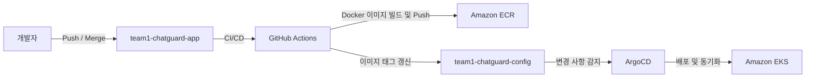

# team1-chatguard-config

## 프로젝트 소개

### 이 저장소의 역할

`team1-chatguard-config`는 ChatGuard 프로젝트의 **쿠버네티스 GitOps 배포 구성 저장소**입니다.

애플리케이션 소스 코드와 분리하여 개발(dev) 및 운영(prod) 환경에 배포하기 위한 쿠버네티스 매니페스트를 관리하며, GitOps 방식으로 클러스터의 배포 구성을 선언적으로 유지합니다.

### 애플리케이션(app) 및 인프라(infra) 저장소와의 관계

- **애플리케이션 저장소 (`team1-chatguard-app`)**: Spring Boot 채팅 서버, Python AI 모더레이션 워커, React 프론트엔드 등 애플리케이션 소스 코드와 컨테이너 이미지 빌드를 관리합니다.
- **구성 저장소 (`team1-chatguard-config`)**: 빌드된 컨테이너 이미지를 기반으로 환경별 쿠버네티스 매니페스트와 오토스케일링, Ingress, Secret 참조 등 배포 구성을 관리합니다. *(본 저장소)*
- **인프라 저장소 (`team1-chatguard-infra`)**: Terraform을 이용하여 VPC, EKS, RDS, ElastiCache Redis, IAM 등 서비스 실행에 필요한 AWS 인프라 리소스를 코드(IaC)로 관리합니다.

### GitOps(Kustomize + ArgoCD)를 사용하는 이유

- **환경별 일관성과 재사용성 (Kustomize)**: 공통 매니페스트(Base)를 기준으로 개발(dev) 및 운영(prod) 환경에서 이미지 태그, 복제본 수, 환경 변수 등 필요한 항목만 오버레이(Overlay)하여 매니페스트 중복을 최소화했습니다.
- **선언적 지속 배포 (ArgoCD)**: Git 저장소를 단일 기준(Source of Truth)으로 사용하여 저장소의 변경 사항을 EKS 클러스터에 자동으로 동기화합니다. 또한 클러스터에서 발생한 수동 변경은 자동 복구(Self-Healing)를 통해 원래 상태로 유지합니다.

---

## 관리 대상

이 저장소에서는 ChatGuard 서비스를 Kubernetes 환경에 배포하고 운영하기 위한 리소스를 관리합니다.

### 1. 애플리케이션 배포

- **Deployment**: 채팅 서버(`chat-server.yaml`), AI 모더레이션 워커(`worker.yaml`), 프론트엔드(`frontend.yaml`) 배포
- **Service**: 클러스터 내부 통신 및 로드 밸런싱
- **Ingress**: AWS Load Balancer Controller(ALB)와 연동하여 HTTP 및 WebSocket 트래픽 라우팅

### 2. 환경 설정 및 Secret 관리

- **ConfigMap**: 공통 애플리케이션 설정 및 Grafana 대시보드 구성 관리
- **ExternalSecret / ClusterSecretStore**: AWS Secrets Manager의 비밀 정보를 Kubernetes Secret으로 동기화

### 3. 오토스케일링 및 가용성

- **KEDA ScaledObject**: Redis 검열 대기열 길이와 Prometheus 메트릭을 기반으로 AI 워커 및 채팅 서버 자동 확장
- **PodDisruptionBudget(PDB)**: 노드 업데이트 및 장애 발생 시 최소 가용 파드 수 보장

### 4. 권한 및 모니터링

- **ServiceAccount (IRSA)**: IAM Roles for Service Accounts(IRSA)를 이용하여 파드에 AWS 권한 부여
- **PodMonitor**: Prometheus 메트릭 수집 대상 등록
- **PrometheusRule**: 서비스 지연 및 장애 감지를 위한 경보 규칙 정의

### 5. GitOps 배포

- **ArgoCD Application**: 환경별 GitOps 동기화 및 배포 관리

---

## 디렉터리 구조

```text
team1-chatguard-config/
├── .github/
│   └── workflows/
│       └── claude-review.yml
├── argocd/
│   ├── dev-app.yaml
│   └── prod-app.yaml
├── base/
│   ├── configurations/
│   │   └── scaledobject-name-reference.yaml
│   ├── grafana/
│   │   └── dashboards/
│   │       └── chatguard-scaleout-dashboard.json
│   ├── chat-server-scaledobject.yaml
│   ├── chat-server.yaml
│   ├── configmap.yaml
│   ├── frontend.yaml
│   ├── ingress.yaml
│   ├── kustomization.yaml
│   ├── pdb.yaml
│   ├── podmonitor.yaml
│   ├── prometheus-rules.yaml
│   ├── scaledobject.yaml
│   ├── serviceaccount.yaml
│   ├── worker-pdb.yaml
│   ├── worker-podmonitor.yaml
│   └── worker.yaml
└── overlays/
    ├── dev/
    │   ├── configurations/
    │   │   └── secret-name-reference.yaml
    │   ├── patches/
    │   │   └── ingress-tags.yaml
    │   ├── clustersecretstore.yaml
    │   ├── externalsecret.yaml
    │   ├── kustomization.yaml
    │   └── prometheus-rules-dev.yaml
    └── prod/
        ├── configurations/
        │   └── secret-name-reference.yaml
        ├── patches/
        │   └── ingress-tags.yaml
        ├── clustersecretstore.yaml
        ├── externalsecret.yaml
        ├── kustomization.yaml
        └── prometheus-rules-prod.yaml
```

| 디렉터리 | 설명 |
|----------|------|
| `.github/workflows` | GitHub Actions 워크플로우를 관리합니다. |
| `argocd` | 환경별 ArgoCD Application 매니페스트를 관리합니다. |
| `base` | 모든 환경에서 공통으로 사용하는 Kubernetes 매니페스트를 관리합니다. |
| `base/configurations` | Kustomize의 Name Reference 등 사용자 정의 설정을 관리합니다. |
| `base/grafana` | Grafana 대시보드 구성 파일을 관리합니다. |
| `overlays` | 환경별(Kustomize Overlay) 배포 구성을 관리합니다. |
| `overlays/dev` | 개발(dev) 환경의 이미지 태그, Secret, 모니터링 설정 등을 관리합니다. |
| `overlays/dev/patches` | 개발 환경에서 사용하는 리소스 패치를 관리합니다. |
| `overlays/prod` | 운영(prod) 환경의 이미지 태그, Secret, 모니터링 설정 등을 관리합니다. |
| `overlays/prod/patches` | 운영 환경에서 사용하는 리소스 패치를 관리합니다. |

---

## 배포 흐름

애플리케이션 변경 사항은 GitHub Actions와 ArgoCD를 이용한 GitOps 방식으로 Amazon EKS에 자동 배포됩니다.



### 배포 과정

1. 개발자가 `team1-chatguard-app` 저장소에 변경 사항을 Push하거나 Merge합니다.
2. GitHub Actions가 애플리케이션 이미지를 빌드하여 Amazon ECR에 업로드합니다.
3. GitHub Actions가 `team1-chatguard-config` 저장소의 `kustomization.yaml` 이미지 태그를 최신 버전으로 갱신합니다.
4. ArgoCD가 Config 저장소의 변경 사항을 감지합니다.
5. ArgoCD가 Amazon EKS 클러스터와 상태를 동기화하여 새로운 버전을 롤링 업데이트합니다.

---

## 주요 구성 요소

| 구성 요소 | 역할 |
|---|---|
| **Kustomize** | 공통 Base와 환경별 Overlay를 조합하여 Kubernetes 매니페스트를 관리합니다. |
| **ArgoCD** | Git 저장소를 기준으로 클러스터 상태를 자동으로 동기화하는 GitOps 배포를 수행합니다. |
| **KEDA (ScaledObject)** | Redis 큐 길이와 Prometheus 메트릭을 기반으로 워크로드를 자동 확장합니다. |
| **PodDisruptionBudget (PDB)** | 노드 업데이트나 장애 발생 시 최소 가용 파드 수를 보장합니다. |
| **External Secrets Operator** | AWS Secrets Manager의 Secret을 Kubernetes Secret으로 자동 동기화합니다. |
| **ServiceAccount (IRSA)** | IAM Roles for Service Accounts(IRSA)를 이용해 파드에 AWS 권한을 부여합니다. |
| **Ingress (AWS Load Balancer Controller)** | 외부 HTTP/WebSocket 요청을 각 서비스로 라우팅합니다. |
| **Service** | 클러스터 내부에서 서비스 간 통신과 로드 밸런싱을 제공합니다. |
| **Deployment** | 애플리케이션의 배포, 롤링 업데이트 및 Replica 수를 관리합니다. |
| **PodMonitor & PrometheusRule** | Prometheus 메트릭 수집과 알림 규칙을 관리합니다. |

---

## 관련 레포지토리

| 레포지토리 | 설명 |
|---|---|
| **team1-chatguard-app** | Spring Boot 채팅 서버, Python AI 모더레이션 워커, React 프론트엔드 등 애플리케이션 소스 코드를 관리합니다. |
| **team1-chatguard-config** | Kubernetes 매니페스트와 ArgoCD를 이용한 GitOps 배포 구성을 관리합니다. *(본 저장소)* |
| **team1-chatguard-infra** | Terraform을 이용하여 AWS 인프라(VPC, EKS, RDS, ElastiCache, IAM 등)를 코드(IaC)로 관리합니다. |